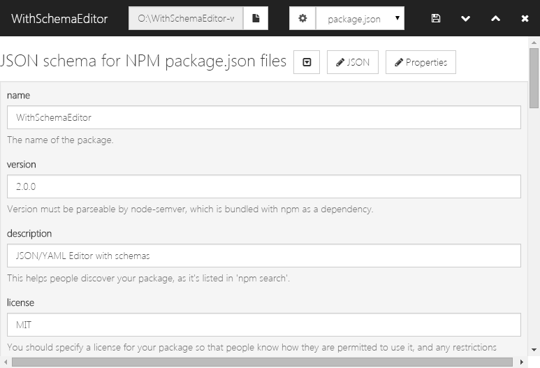

WithSchemaEditor
===================

JSON/YAML or any structured data Editor with schemas - using [JSON Editor](https://github.com/jdorn/json-editor)


[](https://app.fossa.io/projects/git%2Bgithub.com%2FNarazaka%2FWithSchemaEditor?ref=badge_shield)

[Schema Plugin](https://www.npmjs.com/search?q=with-schema-editor-schema)
-------------------
WithSchemaEditor requires "schema plugins", node modules whose package name starts with `with-schema-editor-schema-`.

Since node modules' minimal form only requires `index.js`, minimal schema plugin is like below.

- node_modules/with-schema-editor-schema-foo/index.js

```javascript

var fs = require('fs');

module.exports = {
  name: 'foo plugin', // schema plugin name
  read_type: 'file', // file / directory / both
  filters: function(app) { // file dialog filters (electron)
    return [
      {
        name: 'JSON',
        extensions: ['json']
      }, {
        name: 'All files',
        extensions: ['*']
      }
    ];
  },
  load: function(app) { // load target(file or directory) function
    var data = JSON.parse(fs.readFileSync(app.target()));
    app.editor().setValue(data);
  },
  save: function(app) { // save function
    var data = JSON.stringify(app.editor().getValue());
    fs.writeFileSync(app.target(), data);
  },
  schema: function(app) { // JSON schema (JSON Editor)
    return {
      title: 'config',
      type: 'object',
      format: 'grid',
      properties: {
        target: {
          title: 'Target',
          type: 'string'
        },
        schema: {
          title: 'Schema Name',
          type: 'string'
        }
      }
    };
  }
};
```

License
-------------------
This is released under [MIT License](http://narazaka.net/license/MIT?2015).


## License
[](https://app.fossa.io/projects/git%2Bgithub.com%2FNarazaka%2FWithSchemaEditor?ref=badge_large)